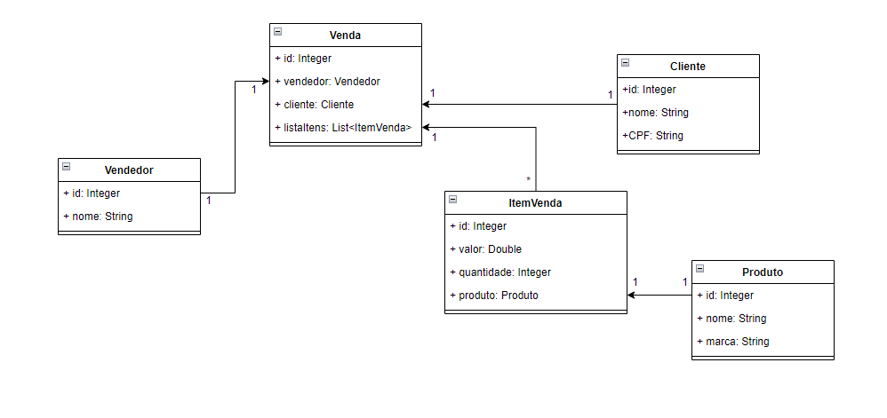

# DesafiosBeca-MoniqueParente

# Desafio(1) Beca : Modelo Conceitual

Nome: Monique Parente Lima.|
Categoria: CJ Junior – Center.| 
Mentor: Flavius Gama.
______________________________________________________________________________________________________________________________________________________________________________
1.	Pensamentos Iniciais de Estruturação.
2.	Resumo da aplicação.
3.	Ferramentas.
4.	Frameworks.
5. Endpoints
______________________________________________________________________________________________________________________________________________________________________________
1.	Pensamentos Iniciais de Estruturação.

Para introduzir alguns pensamentos nesse tópico devemos planejar algumas estratégias que de início podem parecer imaturas porém vão se tornar mais concretas, ágeis e compactas para evitar erros de execução.  

Algumas dicas para estruturação de um sistema, pensar de forma objetiva, escolher um substantivo adequado para definir uma entidade, utilizar de raciocínio lógico inspirado em programação orienta objeto e por fim verificar a normalização. Existem diversos ambientes nos quais podem ser utilizados para realizar um Modelo de Entidade Relacional (MER), alguns exemplos: BrModelo, Draw.oi, entre outros.

2.	Resumo da Aplicação

Plano de Negócios.

A aplicação MP Peças tem como objetivo proporcionar a venda de produto que integra a montagem de um computador.
	Escopo do Produto
O produto final MP Peças consiste em uma aplicação para vendas.
As funções da aplicação consistem em cadastrar uma venda relacionada com os cadastros relacionados aos atributos das classes vendedor, cliente ,item venda e produto.   

 
 IDE utilizada na modelagem: Draw.io.

Conclusão, o usuário deste site poderá cadastrar uma venda através dos cadastros nos domínios, vendedor, cliente, item de venda e produto que constarão no sistema.

  •	Premissas: 
- Aplicação será desenvolvida de Segunda-Feira às Sextas-Feiras em horário comercial.

 •	Restrições:
- Tratamento de erros relacionados ao desenvolvimento e versionamento.

3.	Ferramentas
- GitHub.
- Intelij.
- Draw.io.
- Postman

4.	Frameworks
- JPA.
- Sprint Boot.

5. Endpoints
 
Requisições | Descrição|
:-------------: | :----------------: 
 POST/produto | Cria um produto no sistema
 Post/itemvenda | Cria um item de venda no sistema

